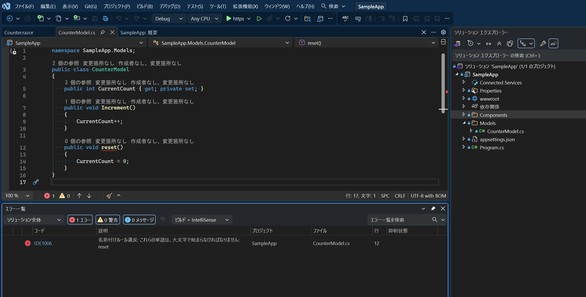

# C# Coding Rules

このリポジトリは `.editorconfig` を使用して C# のコーディングルールを定義・強制する方法を示すサンプルです。

## 概要

- `.editorconfig` - コーディングルールの定義ファイル
- `coding-rules.md` - 各ルールの詳細な説明
- `SampleApp/` - ルール違反時のエラーを確認するためのサンプルプロジェクト

## サンプルプロジェクトについて

`SampleApp` は命名規則違反時に IDE1006 エラーが発生することを示すプロジェクトです。

`CounterModel.cs` の `reset` メソッドは PascalCase（`Reset`）であるべきところを camelCase で定義しているため、以下のようにエラーが表示されます。

## 使い方

1. `.editorconfig` を自分のプロジェクトのルートフォルダにコピー
2. 必要に応じてルールをカスタマイズ
3. IDE または `dotnet build` でルール違反がエラーとして検出される

## ライセンス

[MIT License](LICENSE)
